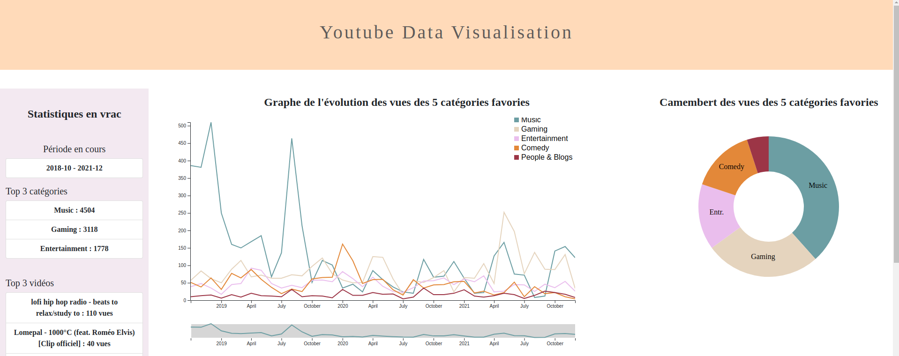

# Projet de visualisation de l'historique Youtube

### Membres du projet
- Jauseau Baptiste - baptiste.jauseau@etu.univ-lyon1.fr
- Lambert Timothé - timothee.lambert@etu.univ-lyon1.fr
- Savatez Quentin - quentin.savattez@etu.univ-lyon1.fr

>Version Anglaise
### Surroundings
We did this project in the context of Data vizualisation course ([courses](https://lyondataviz.github.io/teaching/lyon1-m2/2021/)) of the Data Science Master at the Claude Bernard University.

### Subject
The project's topic was the visual representation of our personnels datas. We chose to depict our Youtube history with 2 shapes : one linear graph and one pie chart.
We gathered our datas thanks to Google API ([API Link](https://console.cloud.google.com/apis))

### Web page 
[Web site link](https://gtdn.github.io/Youtube-Historique-Visualisation/)

- If you wish to test this web site on your datas, follow the instructions in the [Reference](https://gtdn.github.io/Youtube-Historique-Visualisation/ressources.html) onglet, at the bottom of the page.

>Version Francaise
### Cadre
Ce projet est fait dans le cadre de l'UE Data Visualisation ([cours](https://lyondataviz.github.io/teaching/lyon1-m2/2021/)) du Master Data Science à l'Université Claude Bernard. 

### Sujet
Le thème du projet était la représentation visuelle de nos données personnelles. Nous avons choisi de représententer notre historique Youtube sous 2 formes : un graphe  et un camembert. 
Nous avons récupérer ses données gràce à l'API de Google ([API lien](https://console.cloud.google.com/apis))

### Web page du site 
[Lien du site web](https://gtdn.github.io/Youtube-Historique-Visualisation/)

- Si vous souhaitez tester le site web sur vos données, suiver les instructions dans l'onglet [Réference](https://gtdn.github.io/Youtube-Historique-Visualisation/ressources.html), en bas de page du site web.

