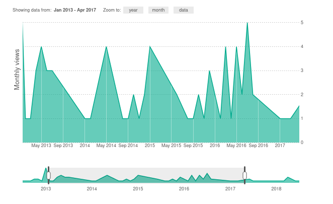

**Quel est le problème abordé / à quel besoin répondez vous ?**

_Expliquer en un paragraphe le problème que vous abordez, et le besoin auquel vous souhaitez répondre._

Lors de ce projet, nous nous intéressons à la répartition des différentes catégories/tags de vidéos YouTube regardées afin de pouvoir voir les statistiques de nos comptes personnels et de pouvoir les comparer entre eux. De plus, cela nous permettra également de voir dans le temps, notre évolution des vidéos regardées et de voir si suivant une période donnée on regarde une catégorie plus qu'une autre. Enfin, on pourra s'intéresser à des statistiques plus basiques comme la vidéo la plus regardée...

**À qui s’adresse la visualisation, quelles tâches seront effectuées au travers de votre projet ?**

_Clarifier le public principal de votre projet. Lister 3 tâches que votre projet permettra d’effectuer. Par ex. : “identifier l'application qui  consomme le plus de données sur mon smartphone”. Expliquer pourquoi ces  tâches vous semblent les plus importantes._

La visualisation s'adresse principalement aux personnes s'interrogeant sur leur historique YouTube.

Les différentes tâches réalisées à l'aide de la visualisation obtenue sont :

* Observation de la répartition des catégories regardées
* Observation de la vidéo la plus vue du compte sur une période donnée
* Observation de l'évolution des vidéos regardées

**Sources de données choisies**

_Lister les sources de données identifiées, pour chacune identifier leur  intérêt principal et leurs limites potentielles. Clarifier si vous  souhaitez en fusionner plusieurs ou pensez privilégier une en  particulier. En cas de surprise/problème imprévu lié aux données, quel  est votre plan de secours ?_

Nous utilisons l'historique Youtube fourni par Google. Cet historique comprend la liste des vidéos visonnées sous forme de Json. Il contient également la date de visionnage ainsi que que son URL. A l'aide de cet URL nous récupérons la catégorie et les tags associés grâce à l'API Youtube. Limite : L'API Youtube ne permet pas d’accéder à un nombre illimité de ressources par jour (10000 requêtes par jour).

**Travaux important liés au projet**

_Lister 3 projets liés au votre, par exemple : des projets avec des jeux  de données similaires, des projets proposant des techniques de  visualisation que vous trouvez intéressantes, des articles scientifiques présentant une technique ou une description du problème qui vous sera  utile... Pour chaque travail, expliquer en quoi il vous semble  intéressant par rapport à votre projet, et en quoi il pourrait être  amélioré._

###### Projet 1 : Trending Youtube Categories Data Visualization :

https://github.com/anitatse/youtube-data-visualization

Diverses visualisations montrant les catégories les plus vues sur Youtube.  

Thématique intéressante pour notre projet, traitement des catégories Youtube et évolution dans le temps. Dans le même esprit que notre projet, line-chart présentant dans le temps l'évolution du visionnage par catégories. Celui-ci s'applique sur les statistiques globales de Youtube, tandis que nous travaillerons sur nos données personnelles.    

Projet 2 : Time-series Line Chart :

https://bl.ocks.org/robyngit/89327a78e22d138cff19c6de7288c1cf

Visualisation de line-chart très intéressante. Possibilité de sélectionner une tranche de date et d'afficher son visuel. Nous allons reproduire cette représentation pour notre projet.  

Projet 3 : Pie Multiple with Nesting 

http://bl.ocks.org/mbostock/1305337

Nous comptons aussi utiliser un affichage camembert pour représenter la proportion de vue par catégories. 

**Organisation**

- _Quels moyens de communications avez vous mis en place (email, tracking github, slack...) ?_

Discord, Github

- _Quelles sessions de travail avez vous prévu hors du cours d’ici à la soutenance de janvier ?_

1 à 2 sessions par semaine (5h/Semaine)

- _Quels rôles avez vous identifiés au sein du groupe (design,  développement D3, pré-traitement des données, suivi, etc.) ? Ces rôles  ne sont pas exclusifs, et il est attendu que tout le monde contribue à  la conception et au code des visualisations. Nous utilisons les  fonctions de suivi de projet de github pour évaluer en partie la  contribution de chacun au projet._

Pré-traitement des données : Tim - Quentin

UI - Baptiste - Quentin

Développement D3 : Tim - Quentin - Baptiste 

**Scan des esquisses finales**

